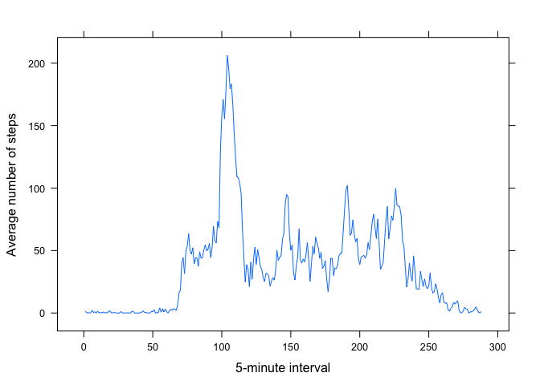

# Reproducible Research: Peer Assessment 1


## Loading and preprocessing the data

```r
library(lubridate)
library(dplyr)
```

```
## 
## Attaching package: 'dplyr'
## 
## The following objects are masked from 'package:lubridate':
## 
##     intersect, setdiff, union
## 
## The following object is masked from 'package:stats':
## 
##     filter
## 
## The following objects are masked from 'package:base':
## 
##     intersect, setdiff, setequal, union
```

```r
library(lattice)
library(stringr)
```
1. Load the file 

```r
activity <- read.csv("activity.csv", stringsAsFactors=FALSE)
```
2. Convert dates for POSIXct and group by date

```r
activity$date <- ymd(activity$date)
daily_steps <- summarize(group_by(activity, date), sum=sum(steps))
```

## What is mean total number of steps taken per day?
1. Histogram of total number of steps taken each day

```r
hist(daily_steps$sum, breaks=20, col = "green", xlab="Steps", xlim=c(0,25000),
     main = "Histogram of Daily Steps")
```

 

2. Calculate and report the mean and median total number of steps taken each day

        Mean

```r
mean(daily_steps$sum, na.rm=TRUE)
```

```
## [1] 10766.19
```
        Median

```r
median(daily_steps$sum, na.rm=TRUE)
```

```
## [1] 10765
```


## What is the average daily activity pattern?
1. Times series line plot of 5-minute intervals to average number of steps taken
across all days

```r
sum_int <- summarize(group_by(activity, interval), mean=mean(steps, na.rm=TRUE))
xyplot(mean ~ 1:length(sum_int$interval), sum_int, type = "l", 
       xlab="5-minute interval", ylab="Average number of steps")
```

 

2.  The interval with the maximum steps.  This represents the 5-minute interval
ending at this time:

```r
sum_int$interval[max(sum_int$mean, na.rm=TRUE)]
```

```
## [1] 1705
```

## Imputing missing values
1. Calculate and report total number of missing values

```r
sum(is.na(activity$steps))
```

```
## [1] 2304
```
2. Missing intervals are filled with the average number of steps for that interval across all days rounded to the nearest integer.  First, identify all missing values

```r
steps_na <- which(is.na(activity$steps), arr.ind=TRUE)
```
3. Create a new data set with the missing data filled in

```r
act_clean <- activity
for (n in steps_na) {
        act_clean$steps[n] <- 
                round(sum_int$mean[sum_int$interval == act_clean$interval[n]])
}
daily_steps_clean <- summarize(group_by(act_clean, date), sum=sum(steps))
```
4.1 Make a histogram

```r
hist(daily_steps_clean$sum, breaks=20, col = "green", xlab="Steps", 
        xlim=c(0,25000), main = "Histogram of Daily Steps")
```

 

4.2 Report mean and median

```r
mean(daily_steps_clean$sum, na.rm=TRUE)
```

```
## [1] 10765.64
```

```r
median(daily_steps_clean$sum, na.rm=TRUE)
```

```
## [1] 10762
```

## Are there differences in activity patterns between weekdays and weekends?

1. Create a new factor variable with two levels - "weekday" and "weekend"

```r
act_clean$weekday <- 
        factor(wday(act_clean$date) %in% 2:6, labels=c("weekend", "weekday"))
sum_int_clean <- summarize(
        group_by(act_clean, interval, weekday), mean=mean(steps))
```

2. Make a panel plot of the 5-minute interval and average number of steps taken,
averaged across all weekday days or weekend days.

```r
xyplot(mean ~ 1:length(sum_int_clean$interval)/2 | weekday, data = sum_int_clean, 
       type = "l", xlab="Interval", ylab="Number of steps", layout = c(1,2))
```

 

From the above comparison of weekday activity compared to weekend activity, the
number of steps are higher in the weekday mornings.  However, overall weekend 
number of steps are more evenly distributed throughout the day.
